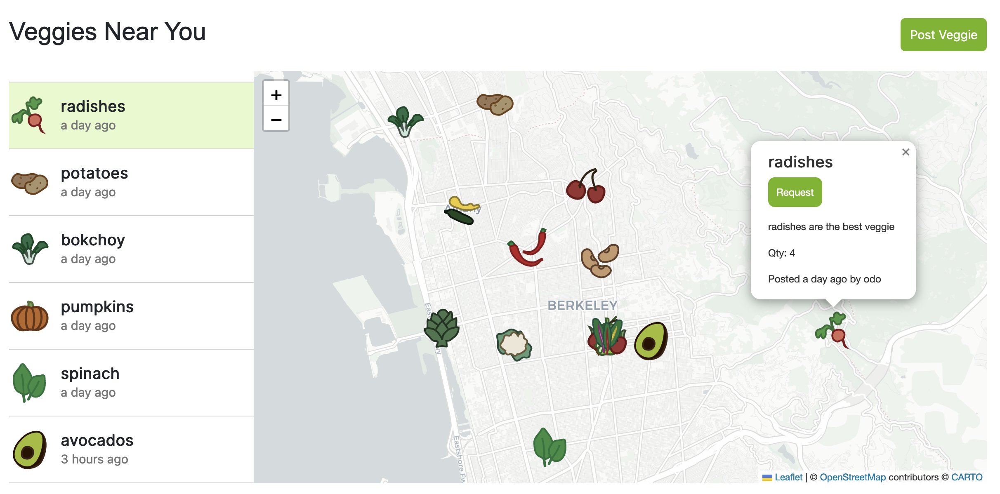
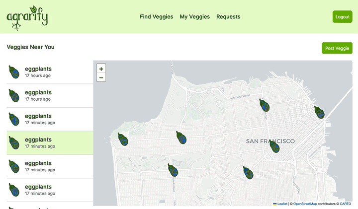
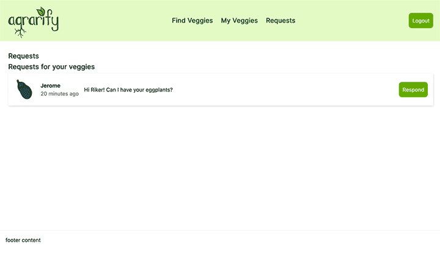

# Join the Agrarian Revolution

[](https://firstdonoharm.dev/version/3/0/full.html)

## Check out the [deployed app](https://agrarify.herokuapp.com) on Heroku

A simple neighborhood crop swap platform. Has life given you lemons? Share the bounty!

---
**Table of Contents**
* [Installation](#installation)
* [Usage](#usage)
* [User Stories & Interesting Code](#user-stories--interesting-code)
* [License](#license)
* [Credits](#credits)
---

## Installation

Install MongoDB first. Then simply `npm install` dependencies, after which you can `npm run develop` to start your server and client locally.

## Usage

Create an account to post and request veggies!

## User Stories & interesting code

### As a user, I want to view available veggies in my area on a map.



````JavaScript
<div id="map-veg" style={{ maxWidth: "1200px" }}>
              <div id="veggie-sidebar">
                <VeggiesList veggies={veggies} onClickShowMarker={onClickShowMarker} userUsername={userUsername} />
              </div>

              <div style={{ flexBasis: "75%" }}>
                <MapContainer center={userCoords || [37.87114171034828, -122.27379801035863]} zoom={13} style={{ height: "500px" }} whenCreated={(map) => mapRef.current = map}>
                  <TileLayer
                    attribution='&copy; <a href="https://www.openstreetmap.org/copyright">OpenStreetMap</a> contributors &copy; <a href="https://carto.com/attributions">CARTO</a>'
                    url="https://{s}.basemaps.cartocdn.com/light_all/{z}/{x}/{y}{r}.png"
                  />

                  {veggies.map((veggie, key) => {
                    if (veggie.owner.username !== userUsername) {
                      return <Marker key={key} ref={(element) => markerRef.current.push(element)} position={veggie.coordinates} icon={icons[veggie.type]} data={veggie._id} eventHandlers={{
                        click: (e) => {
                          selectClickedMarker(e)
                        },
                      }}>
                        <VeggiePopup veggie={veggie} />
                      </Marker>
                    }
                    return <React.Fragment key={key}></React.Fragment>;

                  })}
                </MapContainer>
              </div>
            </div>
````

### As a user, I want to request a veggie I've found on the map.



````JavaScript
const handleFormSubmit = async (event) => {
        event.preventDefault();

        if (formState.content) {

            try {
                const content = formState.content;
                const requestor = localStorage.getItem('_id');

                await createRequest({
                    variables: { content, veggie: veggie._id, requestor },
                });
                window.location.reload();
            } catch (e) {
                console.error(e);
            }
        } else {
            document.getElementById("request-fields").style.display = "block"
        }
    };
````

### As a user, I want to respond to a request for one of my veggies.



````JavaScript
<div className="single-response" key={i}>
        <p className="sender-meta"><strong>{(request.requestor.username === localStorage.getItem('username')) ? "You" : request.requestor.username}</strong> <span className="message-timestamp">{moment().calendar(request.timestamp)}</span></p>
        <p>{request.content}</p>
    </div>
    {/* Traverse the request's array of responses */}
    <div>
        {request.responses.map((response, i) => (
            <VeggieResponses request={request} response={response} key={i} />
        ))}
````

## License
This project uses the [Hippocratic License, v3.0](https://firstdonoharm.dev). TL;DR, it's not *quite* open source, but as long as you're not violating human rights, being a fossil fuel company, conducting military operations, etc (see [license](./LICENSE.md) for full details), you can essentially treat it as open source.

## Credits

Agrarify was built by [Luke](https://github.com/lshillman), [Laura](https://github.com/laurasierra17), and [Mary](https://github.com/mardill) in September 2022. Special thanks to Rosemary for the veggie icons.